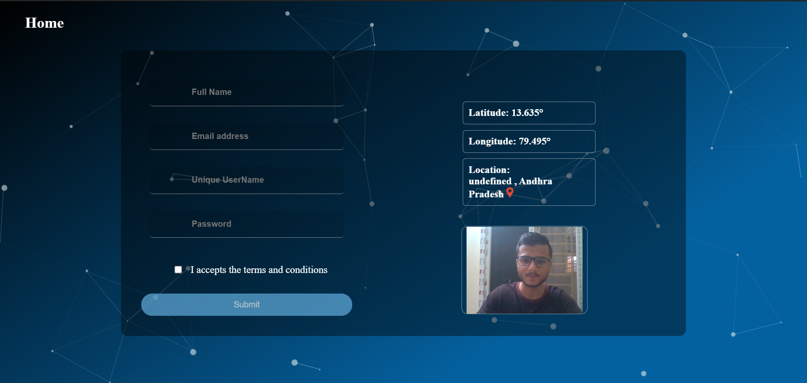
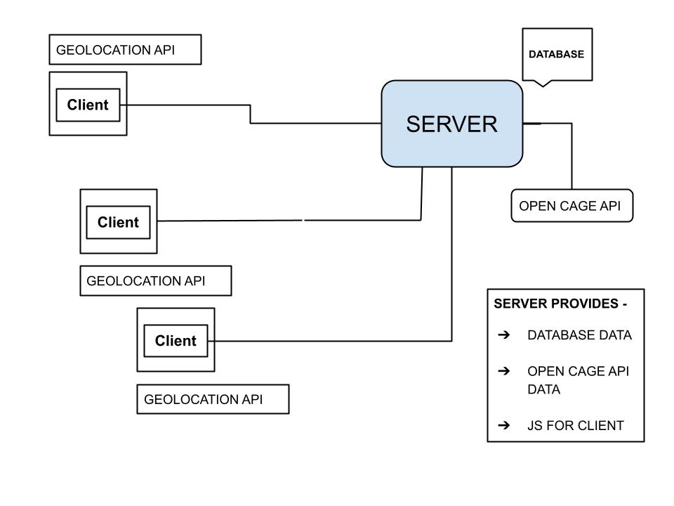

# Location-Camera_SecuredForm

Used 2 Geolocations🌎 API and P5 Library to automatically get the location and photo of the client and stored it into the database NeDB

## PREVIEW

To Run on Local PC go to-  
> create env file>API="PUT YOUR API KEY"

### Flow of Project

